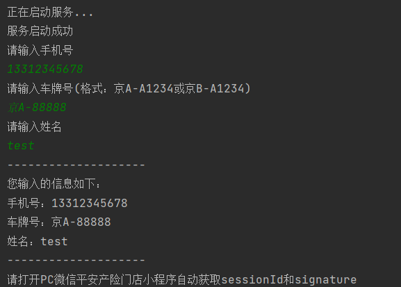
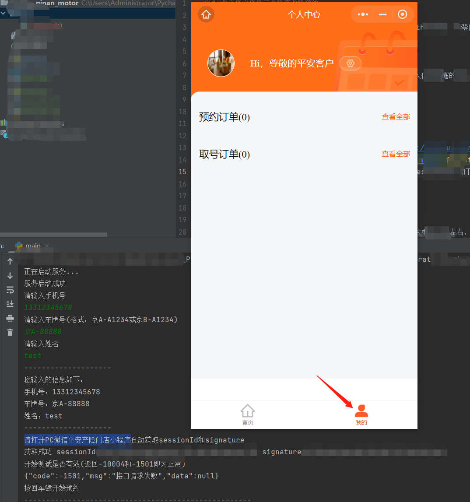
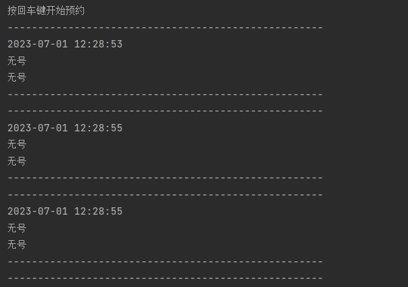

# 北京平安平价三者险商业险预约

本项目旨在帮助用户预约北京平安平价三者险商业险。项目使用Python开发，严禁倒卖和用于牟利。如果发现此类行为，请及时举报，谢谢。

## 由于黄牛倒卖最新版本已经闭源，需要闭源版本的可以加群下载，群里也有容器版本请自行食用，

- [温馨提示](#温馨提示)
- [使用说明](#使用说明)
  - [Windows用户](#windows用户)
  - [Mac/Linux用户](#mac/linux用户)
- [注意事项](#注意事项)
- [交流群](#交流群)
- [问题反馈](#问题反馈)

## 温馨提示

请注意，第三方代抢服务可能需要登录您的微信，这可能会导致个人信息泄露的风险。因此，我们强烈建议您拒绝加价代抢行为。

## 使用说明

### Windows用户

不会抓包的请参照以下步骤：

1. 运行main.py。小白不会配置环境可以直接在[这里](https://github.com/yon1ng/beijing_pinan_motor/releases/tag/v1.0)直接下载可执行程序运行
2. 按照输入您的手机号，姓名，车牌号等信息，如下图所示：
3. 请打开PC微信平安产险门店小程序点击我的预约 会自动获取sessionId，如下图所示：
4. 按回车键开始自动循环预约，如下图所示：

### Mac/Linux用户

如果您会抓包且需要在mac linux等操作系统运行的话，请参照以下步骤：

1. 自行抓包获取sessionId和signature
2. 修改pinanManual.py中为*的参数其中contactName为姓名，contactTelephone为手机号，vehicleNo为车牌号，sessionId为抓包获取的sessionId，signature为抓包获取的signature(格式请参考上面的图片)
3. 运行pinanManual.py

enjoy it！

## 注意事项

- 平安的预约号是每个工作日下午5点放后两个工作日的号。
- 抓取到的`sessionId`如果不执行操作进行刷新的话，有效期大概半小时左右，建议提前20分钟左右再抓取。

## 交流群

新建了一个交流群，欢迎加入。群号是：744382753

## 问题反馈

如果您在使用过程中遇到任何问题，欢迎在[Issues](https://github.com/yon1ng/beijing_pinan_motor/issues)中提出。我们会尽快回复并解决您的问题。如果项目帮助到你，欢迎给我们一个Star。同时，我们也欢迎您提供任何对项目的建议和反馈。
